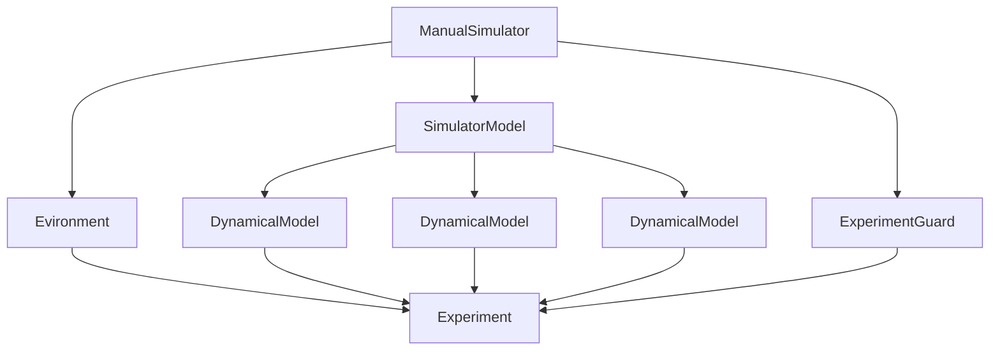
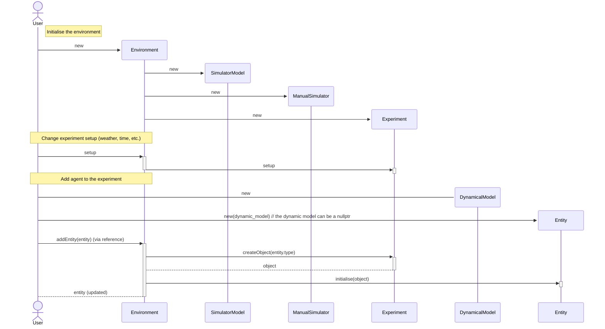

# 🤖 SymAware: Agent Simulation - Prescan Module 🚀

[](https://gitlab.mpi-sws.org/sadegh/eicsymaware/-/blob/prescan/LICENSE)
[](https://www.python.org/downloads/)
[](https://github.com/psf/black)
[](https://gitlab.mpi-sws.org/sadegh/eicsymaware/-/commits/prescan)
[](https://gitlab.mpi-sws.org/sadegh/eicsymaware/-/commits/prescan)
[](https://gitlab.mpi-sws.org/sadegh/eicsymaware/-/packages)
[](https://sadegh.pages.mpi-sws.org/eicsymaware/)

## Introduction

Welcome to SymAware, the Symbolic Logic Framework for Situational Awareness in Mixed Autonomy, a cutting-edge project funded by the European Union.
Imagine an environment where autonomous agents - be it robots, drones, or cars - collaborate seamlessly with humans to complete complex, dynamically evolving tasks.
SymAware is designed to equip these agents with the crucial capability of obtaining situational awareness and enhancing their risk perception abilities.

## Overview

This repository contains code of the `symaware-prescan` package, which is a part of the SymAware project.
The `symaware-prescan` package is a Python module that provides a simulation environment for the agents using [Prescan](https://www.plm.automation.siemens.com/global/en/products/simcenter/prescan.html).


## Requirements

- [Prescan (2024.1)](https://www.plm.automation.siemens.com/global/en/products/simcenter/prescan.html)
- [Python 3.9+](https://www.python.org/downloads/)
- [CMake 3.21+](https://cmake.org/download/)
- c++ compiler
    - [mingw-w64](https://sourceforge.net/projects/mingw-w64/) **Tested**
    - [MSYS2](https://www.msys2.org/) **Untested**
    - [Visual Studio 2019+](https://visualstudio.microsoft.com/) **Untested**

## Installation

To install the package, ideally this command should be sufficient:

```bash
py -m pip install .
```

Based on the machine and software versions, the installation might fail.
Here are some common issues and their solutions:

- **Prescan_base_DIR** in the `CMakeLists.txt` file should be updated to the correct path of the Prescan installation directory
- **pybind11** should have access to the shared libraries of the python distribution in use.
- **mingw-w64** may need to run its own distribution of python in order to install the package.

The executable needs some shared libraries (`ddls`) to be in the `PATH` environment variable. 
This can be done by using the following code snippet in the powershell coonsole:

```powershell
# Update the path to the Prescan installation directory
$prescan_dir = "C:/Program Files/Simcenter Prescan/Prescan_2403" 
# The amount of folders depends on the installed plugins
$env:PATH += ";$prescan_dir/bin;$prescan_dir/Plugins/FullWaveformLidarPlugin/bin;$prescan_dir/Plugins/PBRadarPlugin/bin;$prescan_dir/Plugins/PointCloudLidarPlugin/bin;$prescan_dir/Plugins/ProbabilisticSensorsPlugin/bin;$prescan_dir/Plugins/V2XPlugin/bin"
```

or, in the command prompt:

```bat
@rem Update the path to the Prescan installation directory
set prescan_dir=C:/Program Files/Simcenter Prescan/Prescan_2403
@rem The amount of folders depends on the installed plugins
set PATH=%PATH%;%prescan_dir%/bin;%prescan_dir%/Plugins/FullWaveformLidarPlugin/bin;%prescan_dir%/Plugins/PBRadarPlugin/bin;%prescan_dir%/Plugins/PointCloudLidarPlugin/bin;%prescan_dir%/Plugins/ProbabilisticSensorsPlugin/bin;%prescan_dir%/Plugins/V2XPlugin/bin
```

## Documentation

The documentation for all the packages in the namespace `symaware` is available [here](https://sadegh.pages.mpi-sws.org/eicsymaware/).

## Contacts

- [Gregorio Marchesini](mailto:gremar@kth.se)
- [Arabinda Ghosh](mailto:arabinda@mpi-sws.org)
- [Zengjie Zhang](mailto:z.zhang3@tue.nl)
- [Ernesto Casablanca](mailto:casablancaernesto@gmail.com)


## Use

### Build python bindings

```powershell
python3.11.exe -m pip uninstall symaware-prescan symaware-base -y ; rm  -r -fo 'C:\msys64\mingw64\lib\python3.11\site-packages\symaware' ; python3.11.exe -m pip install . --index-url https://gitlab.mpi-sws.org/api/v4/projects/2668/packages/pypi/simple ; python3.11.exe .\script\stubs.py ; cp .\python\symaware\simulators\prescan\_symaware_prescan.pyi 'C:\msys64\mingw64\lib\python3.11\site-packages\symaware\simulators\prescan'
```


## Dependecy graph




