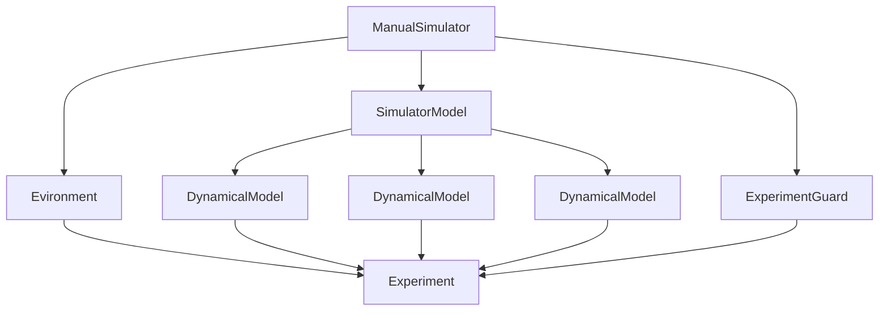
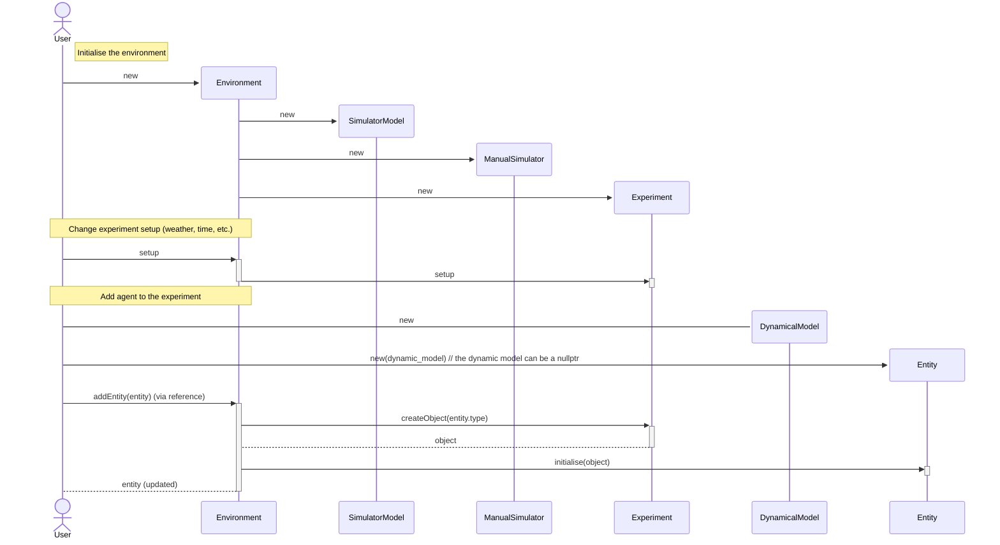

# Symaware

Library extension to allow the python package [Symaware]() to efficiently connect to external simulators that expose c++ API's.

## Requirements

- [Prescan (2024.1)](https://www.plm.automation.siemens.com/global/en/products/simcenter/prescan.html)
- [Python 3.9+](https://www.python.org/downloads/)
- [CMake 3.21+](https://cmake.org/download/)
- c++ compiler
    - [mingw-w64](https://sourceforge.net/projects/mingw-w64/) **Tested**
    - [MSYS2](https://www.msys2.org/) **Untested**
    - [Visual Studio 2019+](https://visualstudio.microsoft.com/) **Untested**

## Installation

## Use

### Ensuring the `PATH` is set correctly

The executable needs some shared libraries (`ddls`) to be in the `PATH` environment variable. This can be done by using the following code snippet in the powershell console before running executable:

```powershell
$prescan_dir = "C:/Program Files/Simcenter Prescan/Prescan_2403"
$env:PATH += ";$prescan_dir/bin;$prescan_dir/Plugins/FullWaveformLidarPlugin/./bin;$prescan_dir/Plugins/PBRadarPlugin/./bin;$prescan_dir/Plugins/PointCloudLidarPlugin/./bin;$prescan_dir/Plugins/ProbabilisticSensorsPlugin/bin;$prescan_dir/Plugins/V2XPlugin/bin"
```

Or, in the command prompt:

```bat
set prescan_dir=C:/Program Files/Simcenter Prescan/Prescan_2403
set PATH=%PATH%;%prescan_dir%/bin;%prescan_dir%/Plugins/FullWaveformLidarPlugin/./bin;%prescan_dir%/Plugins/PBRadarPlugin/./bin;%prescan_dir%/Plugins/PointCloudLidarPlugin/./bin;%prescan_dir%/Plugins/ProbabilisticSensorsPlugin/bin;%prescan_dir%/Plugins/V2XPlugin/bin
```

### Ensuring the `PATH` is set correctly for Python

The executable needs some shared libraries (`ddls`) to be in the `PATH` environment variable. This can be done by using the following code snippet in the powershell console before running executable:

```powershell
$prescan_dir = "C:/Program Files/Simcenter Prescan/Prescan_2403"
$env:PYTHONPATH += ";$prescan_dir/python"
$env:PATH += ";$prescan_dir/bin"
```

Or, in the command prompt:

```bat
set prescan_dir=C:/Program Files/Simcenter Prescan/Prescan_2403
set PYTHONPATH=%PYTHONPATH%;%prescan_dir%\python
set PATH=%PATH%;%prescan_dir%\bin
```

### Build python bindings

```powershell
python3.11.exe -m pip uninstall symaware-prescan symaware-base -y ; rm  -r -fo 'C:\msys64\mingw64\lib\python3.11\site-packages\symaware' ; python3.11.exe -m pip install . --index-url https://gitlab.mpi-sws.org/api/v4/projects/2668/packages/pypi/simple ; python3.11.exe .\script\stubs.py ; cp .\python\symaware\prescan\_symaware_prescan.pyi 'C:\msys64\mingw64\lib\python3.11\site-packages\symaware\prescan'
```


## Dependecy graph




